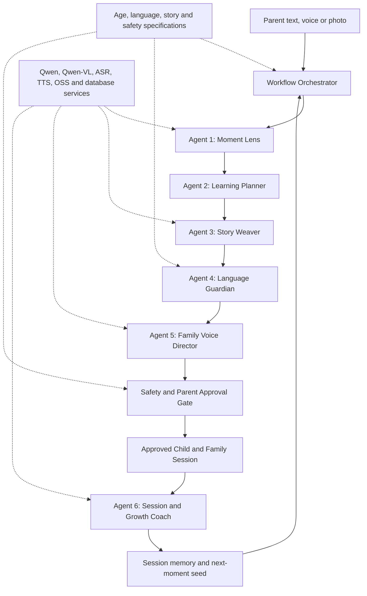

# TaleLah

## Complete Product Requirements Document

| Field | Value |
|---|---|
| Product | TaleLah |
| Working tagline | Everyday moments. Mother-tongue magic. |
| Mascot | Mina the Myna |
| Document status | Implementation-ready |
| Version | 1.0 |
| Date | 26 July 2026 |
| Hackathon | Alibaba Cloud x Qoder Hackathon Singapore 2026 |
| Track | Build Track |
| Submission deadline | 5 August 2026 |
| Winners announced | 8 August 2026 |
| Primary platform | Mobile-first web application / PWA |
| Initial market | Singapore |
| Initial age group | Children aged 4 to 8 |
| Initial languages | Tamil, Chinese and Malay |

This document supersedes the earlier Little Moments PRD. The earlier concept focused on teacher documentation, milestone mapping and a grandparent-specific bridge. TaleLah is a narrower B2C product focused on helping families use their Mother Tongue Language in ordinary life.

---

## 1. Executive Summary

TaleLah turns something that happened to a child today into a five-minute interactive family adventure in the language the family wants the child to keep.

A parent captures one real moment through a photo, voice note or short description. TaleLah creates a short, parent-approved story around that moment in Tamil, Chinese or Malay. Mina the Myna guides the child through the story, listens for a few bounded responses, sends the child on an off-screen speaking mission and hands the final part to a parent, grandparent or other trusted family speaker.

The product is not another unlimited AI bedtime-story generator. Its purpose is to create real mother-tongue use between a child and family members.

### Product promise

**For parents:** Turn today's moment into tonight's mother-tongue conversation.

**For children:** Tell it. Play it. Speak it.

### Golden-path outcome

Within ten minutes, a family should be able to:

1. Capture one real child moment.
2. Approve one generated language goal and story.
3. Let the child complete a four-scene interactive adventure.
4. Hear the child use one useful mother-tongue phrase.
5. Complete one activity away from the screen.
6. Involve one trusted family member.
7. Preserve the child's ending as a family memory.

### North-star metric

**Completed family language moments per active child per week.**

A completed family language moment requires a child speaking turn and either an off-screen mission or family handoff. Opening or passively listening to a story does not count.

---

## 2. Problem

### 2.1 The language-use gap

Singapore children learn Mother Tongue Language in school, but many have fewer reasons to use it naturally at home. The Singapore Department of Statistics reported that English was the language most frequently spoken at home by 48.3% of residents aged five and above in 2020. Reporting on the 2025 General Household Survey places the figure at 58.1%.

School can provide lessons, vocabulary and assessment. Only everyday family life can provide repeated, emotionally meaningful use.

### 2.2 The parent-confidence gap

Many parents want to support their child's Mother Tongue Language but:

- are more comfortable speaking English;
- do not know what phrases match the child's level;
- worry about pronunciation or making mistakes;
- fall back to worksheets, spelling or test preparation;
- do not have time to invent an engaging activity every day.

### 2.3 The relevance gap

Most children's language products start with generic stories, lessons or games. They do not know that the child:

- built an MRT station from blocks today;
- saw a monitor lizard at the park;
- helped make dosa;
- argued about a toy;
- drew a rainbow HDB block;
- visited a wet market with a grandparent.

The child's own life is the strongest available source of relevance, but families currently have to do all the creative work themselves.

### 2.4 The family-participation gap

A fluent family speaker may be present locally or remotely, but current learning products rarely give that person a simple role. Conversely, some homes have no confident speaker at all. The product must support both situations without assuming ethnicity, family structure or grandparent availability.

### 2.5 Why now

- Singapore's three official school Mother Tongue Languages are Chinese, Malay and Tamil.
- MOE Kindergarten emphasizes active interaction, purposeful play and bilingualism for children aged 4 to 6.
- Multimodal models can interpret a real moment and generate a constrained story.
- Speech recognition and speech synthesis can support spoken participation.
- Qoder's spec-driven workflow makes language, safety and age behavior reusable and inspectable.

---

## 3. Product Thesis

Children are more likely to speak a language when it helps them do something meaningful in a familiar situation.

Therefore, TaleLah should not primarily teach through a lesson. It should:

1. Begin with the child's real experience.
2. Select one small speaking objective.
3. Wrap it in a short imaginative adventure.
4. Require a spoken contribution.
5. Move the activity into the physical room.
6. Give another family member a simple part to play.

### One-sentence positioning

**TaleLah is a family language companion that turns a child's real daily moments into parent-approved, five-minute mother-tongue adventures that continue away from the screen.**

### Differentiation

| Alternative | What it does | TaleLah difference |
|---|---|---|
| AI story generator | Creates an entertaining custom story | Starts from a real child moment and targets real speaking use |
| Language-learning app | Teaches vocabulary through lessons or games | Produces a family conversation and physical mission |
| Audiobook or story player | Delivers professionally made passive content | Requires child speech and family participation |
| Parenting coach | Advises the adult | Creates a guided child-family interaction |
| Worksheet or tuition | Optimizes academic performance | Builds confidence and everyday language use |

### Defensibility hypothesis

The defensible product is not story generation alone. It is the combination of:

- a longitudinal memory of the child's real interests and moments;
- language packs designed for Singapore Tamil, Chinese and Malay;
- a safety-constrained interaction model for young children;
- a reusable family participation workflow;
- outcome data about real speaking moments rather than screen engagement.

---

## 4. Goals and Non-Goals

### 4.1 Product goals

1. Make it easy for an English-dominant parent to create a meaningful mother-tongue activity.
2. Get the child to speak, not only listen or tap.
3. Connect the generated experience to something that really happened.
4. Move part of every session away from the screen.
5. Give a family speaker a one-button role.
6. Support families without a fluent speaker through audio and parent coaching.
7. Make all child-facing generated content parent-approved.
8. Demonstrate Qoder-driven reusable agent and language workflows.

### 4.2 Hackathon goals

1. Deliver one polished end-to-end Tamil golden path.
2. Demonstrate Mandarin and Malay through the same language-pack contract.
3. Show six logical AI agents coordinated by one workflow orchestrator.
4. Show a language-spec change producing a verifiable output change without application code changes.
5. Record a clear 2 to 3 minute demo.
6. Gather feedback from at least three parent-child pairs, with consent.

### 4.3 Non-goals for the hackathon MVP

- An unrestricted child chatbot
- Infinite story generation
- A teacher documentation dashboard
- Developmental milestone assessment
- Clinical, diagnostic or therapeutic claims
- Formal language proficiency scoring
- School syllabus replacement
- A social feed or child-to-child communication
- Advertising or personalized marketing to children
- Native iOS or Android applications
- Hardware or smart-speaker integration
- Dynamic video generation
- A large rewards economy, leaderboard or competitive streak system

---

## 5. Users and Jobs to Be Done

### 5.1 Primary buyer and operator: parent or caregiver

**Example:** Priya, 35, working parent, child aged 6, English-dominant home, wants more Tamil conversation.

**Job:** When something interesting happens to my child, help me turn it into a short mother-tongue interaction without requiring lesson planning or fluent speaking confidence.

**Needs:**

- preparation under two minutes;
- confidence that the language is appropriate;
- control over what the child sees;
- help with pronunciation and meaning;
- visible evidence that the child spoke and participated;
- low screen-time guilt.

### 5.2 Primary participant: child aged 4 to 8

**Example:** Arjun, 6, understands common Tamil phrases but answers mostly in English.

**Job:** Let me enter a story about something I care about, make choices, speak without feeling tested and use the story to do something in my world.

**Needs:**

- picture-first interaction;
- a friendly guide;
- one instruction at a time;
- no keyboard or reading dependency;
- patient replay and help;
- celebration without grades;
- short sessions with movement.

### 5.3 Family Voice: confident speaker

This may be a parent, grandparent, relative, sibling, family friend or tutor. The person may be in the room or remote.

**Job:** Give me one clear prompt so I can continue the child's language moment without learning an app or preparing a lesson.

**Needs:**

- one-button entry;
- one prompt at a time;
- natural spoken register;
- no account required for an in-room handoff;
- optional remote participation later.

### 5.4 Family Voice: learning parent

**Job:** Help me participate even if my pronunciation and vocabulary are limited.

**Needs:**

- phrase audio;
- target-language script;
- pronunciation support where appropriate;
- English meaning;
- a safe fallback if the child answers differently.

### 5.5 Future user: teacher or tutor

Teachers and tutors may later send a structured "moment seed" to a parent. They are not operators of the MVP and do not receive documentation or assessment features.

---

## 6. Product Principles

1. **Real before generated.** Every story begins with a real moment supplied by a trusted adult.
2. **Parent approved.** No generated child experience begins without adult review.
3. **One language win.** Each session has one small speaking objective, not a lesson plan.
4. **Speaking over tapping.** A successful session includes a child speaking turn.
5. **The screen knows when to disappear.** Every story includes an off-screen mission.
6. **Family, not a specific family structure.** Never assume a grandparent, ethnicity, religion or household type.
7. **Help without judgment.** No scores, red marks, rankings or "behind" labels.
8. **Bounded AI for children.** Child interactions are constrained to the current activity.
9. **Privacy by default.** Collect and retain the minimum child data needed.
10. **Language quality is a product feature.** Every language pack has explicit register, pronunciation and verification rules.
11. **Mina has a job.** The mascot guides, listens, helps and hands off; it is not decorative.
12. **Polish the golden path.** A complete small experience beats a broad unfinished platform.

---

## 7. Brand and Experience Direction

### 7.1 Name

**TaleLah** is the working product name.

Rationale:

- easy for young children to say;
- combines story with a recognizable Singapore conversational tone;
- does not belong to one ethnic or language community;
- supports an energetic spoken brand.

A formal trademark, company-name and domain review is required before commercialization.

### 7.2 Mascot

**Mina the Myna** is a rounded, child-friendly myna bird associated with listening, voice and imitation.

Required mascot states:

| State | Pose | Product meaning |
|---|---|---|
| Welcome | Waving wing | Start or resume |
| Listening | Wing beside ear | Microphone is active |
| Thinking | Looking upward | System is processing |
| Help | Holding a phrase card | Replay or pronunciation support |
| Mission | Pointing away from screen | Physical-world action |
| Handoff | Offering a story token | Give the turn to family |
| Celebrate | Wings open | Completion |
| Rest | Sleeping on a branch | Session ended |

### 7.3 Visual system

Core colors:

- Charcoal blue for trust and readable text
- Sunflower yellow for energy and Mina's accents
- Teal for guidance and active controls
- Coral for child interaction
- Soft mint for calm backgrounds

Avoid a purple-dominant visual system so TaleLah remains distinct from Nora and other common AI-character products.

### 7.4 Parent and child modes

**Parent mode**

- calm, efficient and text-supported;
- clear status and privacy controls;
- restrained animation;
- utility-first review and editing.

**Child mode**

- full-scene illustrated composition;
- one primary action per screen;
- large visual choices;
- minimal text;
- audio instructions;
- stable control positions;
- no settings, feeds, prompts or outbound navigation.

### 7.5 Child interaction standards

- Minimum primary touch target: 56 by 56 CSS pixels
- Maximum visible choices: 3
- Maximum child-facing instruction: one short sentence
- No required typing
- No hidden gestures
- Replay button always available during narration
- Microphone state must be visually obvious
- Every audio instruction must have a visual equivalent
- Tamil, Simplified Chinese and Malay text must render without clipping
- Child mode must work on common mobile widths from 320 pixels

### 7.6 Existing design artifacts

- `brand-concepts/talelah-mina-mascot-v1.png`
- `brand-concepts/talelah-logo-concept-v1.png`
- [Published interactive experience flow](https://talelah-experience-flow.vinothjv.chatgpt.site)

---

## 8. Core Product Concepts

### 8.1 Moment

A trusted adult's description of something the child experienced, made, saw, asked or attempted. A moment can contain:

- one photo;
- one voice note;
- one short text description;
- optional context such as location or family relevance.

### 8.2 Speaking goal

One observable language action for the session, such as:

- name one color;
- describe one object;
- ask one question;
- predict what comes next;
- tell a family member what happened;
- use one polite request.

The speaking goal is not a proficiency score.

### 8.3 Story Package

The approved unit delivered to child mode:

- story title;
- factual moment seed;
- four short scenes;
- one of up to three opening story directions;
- three to five target words;
- one target phrase;
- TTS narration;
- bounded child-response intents;
- one off-screen mission;
- one family handoff;
- one ending prompt;
- safety and language validation status.

### 8.4 Family Voice

The trusted adult who continues the final part of the experience. Available modes:

1. **Confident speaker in the room**
2. **Learning parent with phrase coaching**
3. **Pre-recorded trusted family voice**
4. **Remote family link** (post-MVP)

### 8.5 Language Pack

A versioned specification defining language behavior independently of application code.

Each pack includes:

- locale and script;
- age and confidence bands;
- common Singapore vocabulary;
- approved code-switching rules;
- parent-help format;
- transliteration or pronunciation format;
- speech recognition hints;
- TTS voice configuration;
- register and honorific guidance;
- cultural and stereotype safeguards;
- test cases and verifier status.

Initial packs:

| Language | Locale | Script | Parent support |
|---|---|---|---|
| Tamil | `ta-SG` | Tamil | Spoken audio, Tamil script, consistent parent pronunciation guide, English meaning |
| Chinese | `zh-SG` | Simplified Chinese | Spoken audio, Chinese characters, Hanyu Pinyin, English meaning |
| Malay | `ms-SG` | Rumi / Latin | Spoken audio, Malay text, English meaning where requested |

Language selection is based on family choice, not inferred from ethnicity.

---

## 9. Scope

### 9.1 P0: Hackathon MVP

The submission is complete only when all P0 items work end to end.

1. Adult account or demo parent gate
2. One child profile with alias, age, selected MTL and confidence
3. Family-speaker selection
4. Text, voice or single-photo moment capture
5. Six-agent product workflow
6. Parent review, edit and approval
7. Child handover screen
8. Up to three visual story-direction choices
9. Four-scene child experience
10. TTS narration
11. At least one constrained child speech response
12. Speech fallback when recognition fails
13. One off-screen room mission
14. One in-room family handoff
15. One learning-parent coaching mode
16. Session completion and memory summary
17. Parent progress view with phrases and family moments
18. Tamil golden path fully tested
19. One verified Mandarin sample and one verified Malay sample
20. Language-pack swap demonstrated without code changes
21. Safety gate and parent approval enforced
22. Raw child audio not retained by default
23. Instrumented demo events
24. Mobile responsive UI

### 9.2 P1: Stretch after P0 is polished

- Pre-recorded family voice for selected story lines
- Shareable remote family handoff link
- Additional story templates
- Multiple child profiles
- Parent favorites and replay
- Offline-friendly replay of an approved Story Package
- Parent feedback: too easy, just right or too hard
- A weekly family-language recap
- Teacher or tutor moment link

### 9.3 Post-hackathon roadmap

- Native mobile applications
- Trusted remote-relative accounts
- Family voice library
- More age bands
- Dialect and additional community-language pilots
- Preschool and enrichment-center distribution
- Smart-speaker and child-safe audio-device integration
- Optional physical story token or NFC interaction
- Longitudinal language-confidence insights validated with educators

---

## 10. End-to-End User Journey


### Stage 1: Adult Gate

**Owner:** Parent

**Purpose:** Keep accounts, permissions, generation and privacy controls outside child mode.

Flow:

1. Parent enters or selects demo mode.
2. Parent accepts child-data and microphone disclosures.
3. Parent creates a child alias and age band.
4. The application confirms that TaleLah is a family activity, not an assessment.

Exit condition: a valid parent session and child profile exist.

### Stage 2: Language and Family Profile

**Owner:** Parent

Parent selects:

- Tamil, Chinese or Malay;
- child understanding level;
- child speaking level;
- strongest available family speaker;
- in-room confident speaker or learning-parent mode;
- interests the child enjoys.

Confidence uses plain descriptions:

- **Beginning:** recognizes a few familiar words
- **Emerging:** understands common phrases, often answers in English
- **Growing:** answers with short phrases
- **Conversational:** can tell a short story with support

Exit condition: a language pack and speaking level are assigned.

### Stage 3: Capture a Moment

**Owner:** Parent

Parent can:

- type up to 500 characters;
- record a voice note up to 45 seconds;
- upload one JPEG, PNG or HEIC photo up to 10 MB.

Example:

> Arjun made an MRT route using colored blocks and explained which station comes next.

System behavior:

- displays upload and processing status;
- warns if a photo contains multiple visible faces;
- allows photo removal before submission;
- never asks the parent to write an AI prompt.

Exit condition: a usable factual moment seed is available.

### Stage 4: Generate and Approve

**Owner:** Parent

The orchestrator runs the pre-session portion of the workflow, Agents 1 to 5, initializes Agent 6's bounded session state and returns one review page containing:

- what TaleLah understood from the moment;
- proposed story direction;
- target words;
- one speaking goal;
- off-screen mission;
- family handoff;
- language and safety status.

Parent can:

- edit the factual seed;
- replace a target word;
- change difficulty;
- regenerate one component;
- approve the complete Story Package.

Nothing is available in child mode until approval.

Exit condition: `StoryPackage.status = approved`.

### Stage 5: Child Handover and Choice

**Owner:** Child

The parent taps **Give to child**. A short press-and-hold adult gesture is required to leave child mode.

Mina introduces the moment and offers up to three picture-first directions, for example:

- The Missing MRT Color
- The Station That Moved
- Mina's Secret Route

No prompt box, feed, browser navigation or settings are visible.

Exit condition: the child selects a direction.

### Stage 6: Interactive Story and Speech

**Owner:** Child

The four-scene story uses:

- pre-approved illustrations or scene templates;
- pre-generated narration;
- one response opportunity per scene;
- large picture choices where speech is not required;
- one required bounded speaking turn;
- immediate use of the child's response in the next line.

Speech sequence:

1. Mina models the phrase.
2. Child taps or holds the microphone.
3. The system listens only for the current expected intent.
4. If confidence is high, the story responds.
5. If confidence is low, Mina offers replay, slower audio or picture choice.
6. The child is never marked wrong.

Exit condition: required story scenes are completed or the parent exits.

### Stage 7: Off-Screen Mission

**Owner:** Child

The display dims into a quiet mission screen. Mina gives one physical-world task, such as:

> Find something in the room with the same color. Bring it to someone and say, "This is red."

Rules:

- mission uses safe household actions;
- no climbing, cooking, leaving the home or interacting with strangers;
- child can tap **I'm back** or the parent can skip;
- the story waits rather than continuously stimulating the child.

Exit condition: child returns or mission is skipped.

### Stage 8: Family Handoff

**Owner:** Family Voice

The child hands the device to the selected family speaker.

Confident-speaker mode:

- one target-language prompt;
- one large play/replay button;
- one response suggestion;
- no English unless requested.

Learning-parent mode:

- target-language script;
- audio playback;
- pronunciation support;
- English meaning;
- a suggested response if the child answers in English.

Example:

> Ask Arjun which station his red block should visit next. Let him answer before helping.

Exit condition: family member marks the exchange complete or skips.

### Stage 9: Remember

**Owner:** Parent and child

Mina asks one ending question. The parent may optionally save:

- a short text ending;
- one photo of the completed mission;
- an explicitly consented voice memory.

The default session summary stores:

- Story Package ID;
- target phrase;
- completion state;
- response intent, not raw audio;
- off-screen mission completion;
- family handoff completion;
- session duration.

The parent sees:

- phrase used today;
- family minutes;
- next suggested moment;
- replay or delete controls.

No score is shown to the child.

---

## 11. Screen Inventory

| ID | Mode | Screen | Primary action |
|---|---|---|---|
| P01 | Parent | Welcome / Adult Gate | Continue as parent |
| P02 | Parent | Child Profile | Save profile |
| P03 | Parent | Language and Family Voice | Choose setup |
| P04 | Parent | Home | Create today's adventure |
| P05 | Parent | Moment Capture | Submit moment |
| P06 | Parent | Generating | Wait or cancel |
| P07 | Parent | Review and Approve | Approve Story Package |
| P08 | Parent | Edit Component | Save changes |
| C01 | Child | Handover | Start with Mina |
| C02 | Child | Story Direction | Choose one of up to three |
| C03 | Child | Story Scene | Listen or choose |
| C04 | Child | Speak | Hold microphone |
| C05 | Child | Help | Replay, slower or picture answer |
| C06 | Child | Room Mission | Go, return or skip |
| F01 | Family | Handoff | Continue together |
| F02 | Family | Phrase Coach | Play and speak |
| C07 | Child | Story Ending | Give ending |
| P09 | Parent | Session Summary | Save or delete |
| P10 | Parent | Progress | View family moments |
| P11 | Parent | Privacy and Data | Export or delete |

---

## 12. Functional Requirements

Priority definitions:

- **P0:** required for hackathon submission
- **P1:** build only after P0 is stable
- **P2:** post-hackathon

### 12.1 Adult access and profiles

| ID | Priority | Requirement |
|---|---|---|
| FR-001 | P0 | The system shall require an adult session before profile creation, generation or data management. |
| FR-002 | P0 | The parent shall create a child profile using an alias, age band, selected language and confidence descriptions. |
| FR-003 | P0 | The system shall not require the child's full legal name, school, birth date or face photo. |
| FR-004 | P0 | The parent shall select a Family Voice mode. |
| FR-005 | P1 | One adult account may manage multiple child profiles. |
| FR-006 | P0 | Leaving child mode shall require an adult-only press-and-hold interaction. |

### 12.2 Moment capture

| ID | Priority | Requirement |
|---|---|---|
| FR-010 | P0 | The parent shall create a moment using text, voice or one photo. |
| FR-011 | P0 | Text input shall be limited to 500 characters. |
| FR-012 | P0 | Voice input shall be limited to 45 seconds and transcribed for review. |
| FR-013 | P0 | Photo input shall accept JPEG, PNG or HEIC up to 10 MB. |
| FR-014 | P0 | The parent shall be able to remove media before generation. |
| FR-015 | P0 | Low-confidence interpretation shall trigger a parent clarification rather than invented detail. |
| FR-016 | P0 | Uploaded source media shall have an explicit retention state. |

### 12.3 Generation and approval

| ID | Priority | Requirement |
|---|---|---|
| FR-020 | P0 | The orchestrator shall execute the six-agent workflow over a versioned shared schema. |
| FR-021 | P0 | The generated output shall contain exactly one speaking goal. |
| FR-022 | P0 | A Story Package shall contain three to five target words and one target phrase. |
| FR-023 | P0 | A Story Package shall contain four short scenes, one room mission and one family handoff. |
| FR-024 | P0 | The parent shall see the interpreted facts before approval. |
| FR-025 | P0 | The parent shall edit or regenerate individual components without recreating the whole moment. |
| FR-026 | P0 | The system shall block child-mode delivery until parent approval and safety validation are complete. |
| FR-027 | P0 | The system shall record agent, prompt-spec and language-pack versions for each Story Package. |
| FR-028 | P0 | If generation fails, the parent shall be able to retry without re-uploading the moment. |

### 12.4 Child story

| ID | Priority | Requirement |
|---|---|---|
| FR-030 | P0 | Child mode shall show no unrestricted text input. |
| FR-031 | P0 | The child shall receive no more than three choices at one time. |
| FR-032 | P0 | Narration audio shall be prepared before child mode starts. |
| FR-033 | P0 | At least one child response shall use constrained speech recognition. |
| FR-034 | P0 | The system shall provide replay, slower playback and picture fallback. |
| FR-035 | P0 | Speech recognition failure shall never produce a negative judgment. |
| FR-036 | P0 | The story shall continue when the child uses English, remains silent or selects a picture fallback. |
| FR-037 | P0 | The session shall be completable in 5 to 8 minutes. |
| FR-038 | P0 | The child shall be able to pause and request the parent. |

### 12.5 Off-screen mission

| ID | Priority | Requirement |
|---|---|---|
| FR-040 | P0 | Every approved Story Package shall include one physical-world mission. |
| FR-041 | P0 | The mission shall use household-safe behavior and require no special equipment. |
| FR-042 | P0 | The mission screen shall reduce visual stimulation and wait for the child to return. |
| FR-043 | P0 | The mission shall have parent skip and child-return controls. |
| FR-044 | P0 | Mission generation shall reject leaving-home, stranger, climbing, sharp-object, heat, medicine and food-allergy risks. |

### 12.6 Family handoff

| ID | Priority | Requirement |
|---|---|---|
| FR-050 | P0 | Every Story Package shall include one Family Voice prompt. |
| FR-051 | P0 | Confident-speaker mode shall require no account and no English reading. |
| FR-052 | P0 | Learning-parent mode shall provide script, audio, pronunciation support and meaning. |
| FR-053 | P0 | The family speaker shall see only one prompt at a time. |
| FR-054 | P1 | A parent shall invite a remote trusted speaker using an expiring link. |
| FR-055 | P1 | A trusted speaker shall pre-record selected approved lines. |

### 12.7 Completion and progress

| ID | Priority | Requirement |
|---|---|---|
| FR-060 | P0 | The parent shall receive a session summary after completion. |
| FR-061 | P0 | Progress shall show phrases used, completed family moments and family minutes. |
| FR-062 | P0 | The product shall not display grades, ranks or proficiency claims. |
| FR-063 | P0 | Raw audio shall not be stored by default. |
| FR-064 | P0 | Saving a voice memory shall require explicit parent action. |
| FR-065 | P0 | The parent shall delete an individual moment or the full child profile. |
| FR-066 | P1 | The parent shall rate difficulty as too easy, just right or too hard. |

### 12.8 Language packs

| ID | Priority | Requirement |
|---|---|---|
| FR-070 | P0 | Language-specific behavior shall be loaded from a versioned language pack. |
| FR-071 | P0 | Adding or revising a language pack shall not require child-flow application code changes. |
| FR-072 | P0 | Every language output shall pass Language Guardian validation before parent review. |
| FR-073 | P0 | The UI shall identify unverified generated language during internal testing. |
| FR-074 | P0 | Tamil shall have a fully tested demo path. |
| FR-075 | P0 | Mandarin and Malay shall each have at least one human-reviewed sample path. |

### 12.9 Safety and privacy

| ID | Priority | Requirement |
|---|---|---|
| FR-080 | P0 | The child shall not communicate with other users. |
| FR-081 | P0 | Child mode shall contain no external links, advertisements or purchases. |
| FR-082 | P0 | The system shall moderate source moments and generated outputs. |
| FR-083 | P0 | Unsafe or highly sensitive input shall be refused or routed to a neutral fallback. |
| FR-084 | P0 | The product shall not infer health, development, ethnicity, religion or family status from a moment. |
| FR-085 | P0 | Consent and retention controls shall be written for adults in plain language. |
| FR-086 | P0 | Production data shall be encrypted in transit and at rest. |
| FR-087 | P0 | Access to child data shall be scoped to the parent account and audited. |

---

## 13. Agent Architecture

TaleLah uses **six logical agents and one orchestrator**. Safety is an enforced policy layer and approval gate, not a seventh conversational agent. Speech, storage and model APIs are services, not agents.



### 13.1 Orchestrator

**Role:** Own workflow state, execute agents in order, validate schemas, handle retries, enforce gates and preserve an inspectable trace.

Suggested states:

`captured -> interpreting -> planning -> writing -> validating -> awaiting_parent -> approved -> in_session -> completed`

The orchestrator may use Qoder Quest Mode during development and a deterministic application workflow at runtime.

### 13.2 Agent 1: Moment Lens

**Input:** Parent text, transcript or photo; child age; selected language

**Output:**

- factual entities and actions;
- confidence per fact;
- child interest signals;
- ambiguity questions;
- sensitive-content tags.

**Rules:**

- describe only observable information;
- do not identify people;
- do not infer ability, diagnosis or emotion without explicit context;
- ask for clarification below confidence threshold.

**Primary model:** Qwen-VL for image input; Qwen for text normalization.

### 13.3 Agent 2: Learning Planner

**Input:** Verified moment facts; child understanding and speaking level; selected language pack

**Output:**

- one speaking goal;
- three to five target words;
- one target phrase;
- interaction difficulty;
- expected response intents.

**Rules:**

- one language win per session;
- prefer everyday, reusable speech;
- match speaking confidence rather than age alone;
- avoid school-test framing.

### 13.4 Agent 3: Story Weaver

**Input:** Moment facts; learning plan; child interests; approved story templates

**Output:**

- up to three opening directions;
- four-scene story;
- bounded choices;
- room mission;
- ending prompt.

**Rules:**

- preserve the real moment as the anchor;
- do not create open-ended child chat;
- keep total narration suitable for 5 to 8 minutes;
- make the target phrase useful to progress the story;
- include one physical action.

### 13.5 Agent 4: Language Guardian

**Input:** Draft Story Package; selected language pack

**Output:**

- corrected target-language text;
- parent support fields;
- pronunciation and speech hints;
- register and cultural validation;
- pass, revise or block status;
- explanation for internal review.

**Rules:**

- validate every child-facing and family-facing line;
- apply Singapore locale rules;
- reject stereotypes or assumed cultural practices;
- keep child script natural rather than literal translation;
- flag content requiring human verification.

### 13.6 Agent 5: Family Voice Director

**Input:** Validated story; selected Family Voice mode; family confidence

**Output:**

- handoff timing;
- family prompt;
- confident-speaker view;
- learning-parent coaching view;
- TTS segments;
- remote or pre-recorded route when enabled.

**Rules:**

- one instruction at a time;
- adult role supports conversation rather than testing;
- no assumption that a grandparent exists;
- preserve dignity for a learning parent.

### 13.7 Agent 6: Session and Growth Coach

**Input:** Approved Story Package; bounded child responses; session events; parent feedback

**Output:**

- adaptive hint or fallback;
- session completion record;
- next-moment suggestion;
- lightweight difficulty adjustment.

**Rules:**

- operate only within approved response intents;
- do not label proficiency;
- do not preserve raw audio unless parent explicitly saves it;
- adapt gradually and reversibly.

### 13.8 Safety and Parent Approval Gate

The gate verifies:

- source input moderation;
- factual confidence;
- age appropriateness;
- mission physical safety;
- language validation;
- absence of diagnostic or identity inference;
- absence of external links or commercial content;
- parent approval state.

Any failed check blocks child mode.

---

## 14. Story Package Contract

Illustrative runtime structure:

```json
{
  "id": "story_123",
  "status": "approved",
  "childProfileId": "child_123",
  "momentId": "moment_123",
  "language": {
    "locale": "ta-SG",
    "packVersion": "1.0.0"
  },
  "momentFacts": [
    {
      "text": "The child arranged colored blocks as an MRT route.",
      "confidence": 0.96
    }
  ],
  "learningPlan": {
    "speakingGoal": "Describe one color and predict the next stop.",
    "targetWords": ["red", "station", "next"],
    "targetPhrase": "The red train goes to the next station.",
    "level": "emerging"
  },
  "story": {
    "title": "Mina and the Missing MRT Color",
    "openingChoices": [
      "Find the missing color",
      "Repair the secret station",
      "Follow Mina's route"
    ],
    "scenes": [],
    "roomMission": {},
    "familyHandoff": {},
    "endingPrompt": {}
  },
  "media": {
    "narrationSegments": [],
    "sceneAssets": []
  },
  "validation": {
    "language": "passed",
    "safety": "passed",
    "parentApprovedAt": "2026-07-30T12:00:00Z"
  },
  "provenance": {
    "agentSpecVersions": {},
    "modelVersions": {}
  }
}
```

All agents must read and write structured fields. Free-form agent prose must not be passed directly into child mode.

---

## 15. Content and Language Rules

### 15.1 Story rules

- Use only parent-confirmed facts about the real moment.
- Fantasy may extend the moment but must not rewrite it as a claim about the child.
- Use Singapore-relevant settings naturally, not as a checklist.
- Avoid assuming religion, food, housing type or family structure.
- Avoid violence, fear-heavy suspense, body shame and humiliation.
- Avoid persuasive or commercial language.
- Do not ask children to keep secrets from adults.
- Do not tell a child that Mina is a real person or conscious friend.

### 15.2 Speaking rules

- Model before requesting speech.
- Permit code-switching as a bridge.
- Prefer a meaningful partial answer over exact repetition.
- Do not require accent imitation.
- Never display "wrong."
- Give a maximum of two audio retries before offering a non-speech fallback.

### 15.3 Parent-support rules

- Parent help is optional and collapsible.
- English gloss belongs in parent mode, not as the dominant child view.
- Pronunciation support must use one documented convention per language pack.
- Parent prompts should invite, not test: "Tell me what happened" instead of "What is the correct word?"

### 15.4 Human verification

For the hackathon:

- Tamil golden path is reviewed by a fluent Tamil speaker.
- At least one Mandarin path is reviewed by a fluent Mandarin speaker.
- At least one Malay path is reviewed by a fluent Malay speaker.
- Unreviewed dynamic outputs remain clearly marked in internal testing.

---

## 16. Safety, Privacy and Trust

TaleLah targets young children and must use a high-trust product model.

### 16.1 Account model

- Adults own accounts and control profiles.
- Children do not create accounts.
- In-room family handoff does not create another account.
- Remote participation, when added, uses an expiring parent-created invitation.

### 16.2 Data minimization

Required child data:

- alias;
- age band;
- selected language;
- plain-language confidence;
- optional interests.

Not required:

- legal name;
- exact date of birth;
- school;
- address;
- ethnicity;
- face profile;
- contact information.

### 16.3 Media and voice retention

- Voice is transcribed and discarded by default after processing.
- Child speech is converted to an intent and discarded by default.
- Raw photo retention is off by default after Story Package generation.
- The parent may explicitly save a photo or voice memory.
- Saved media has a visible delete control.
- Demo accounts use synthetic or consented media only.

### 16.4 Child-facing AI boundary

- No open prompt input
- No open-domain response generation at runtime
- No outbound links
- No ads
- No purchases
- No direct messages
- No content feed
- No personalized persuasion
- No clinical or emotional dependency language

### 16.5 Compliance posture

The commercial product requires review against:

- Singapore Personal Data Protection Act;
- PDPC Advisory Guidelines on the PDPA for Children's Personal Data in the Digital Environment;
- applicable app-store age ratings and safety requirements;
- model and speech-provider data-processing terms.

This PRD defines product safeguards but is not legal advice.

---

## 17. Failure and Fallback Behavior

| Failure | User experience | System behavior |
|---|---|---|
| Photo unclear | Ask parent what happened | Do not invent visual details |
| Multiple visible faces | Offer crop, remove or continue with disclosure | Do not identify faces |
| Unsafe or sensitive source | Explain that TaleLah cannot use this moment | Suggest a neutral new moment |
| Generation timeout | Show retry and preserve input | Retry idempotently |
| Language validation fails | Keep draft in parent mode | Regenerate failed fields |
| TTS unavailable | Use approved text and parent-read mode | Do not enter silent child flow unexpectedly |
| ASR cannot understand child | Replay, slower prompt, picture choice | Log fallback, not failure |
| Child remains silent | Mina answers together with the child | Continue without judgment |
| No confident family speaker | Use learning-parent mode | Provide script, audio and meaning |
| Child leaves midway | Save local resume point | Parent can resume or delete |
| Network drops after approval | Replay cached approved package where available | Queue completion events |
| Parent declines generated content | Edit, regenerate or delete | Never expose draft to child |

---

## 18. Non-Functional Requirements

### 18.1 Performance

- Text or voice moment to parent review: P95 under 30 seconds
- Photo moment to parent review: P95 under 45 seconds
- Child-scene transition: under 500 ms after local asset availability
- Speech-response feedback: median under 2.5 seconds, P95 under 5 seconds
- Approved Story Package should preload before child handover

### 18.2 Reliability

- Generation retries are idempotent.
- Approved content is immutable during a child session.
- Every generated package records model and spec versions.
- A failed optional service must degrade to a usable fallback.

### 18.3 Security

- TLS for all network traffic
- Encryption at rest for production databases and object storage
- Signed media URLs with short expiry
- Server-side authorization on all profile and media access
- No secrets in client bundles
- Audit events for profile export and deletion

### 18.4 Accessibility

- WCAG 2.2 AA target for parent mode
- Keyboard access for adult controls
- Visible focus states
- Text alternatives for meaningful imagery
- Captions or visible equivalents for audio
- Color is not the only signal
- Reduced-motion support
- Correct language tags for Tamil, Chinese, Malay and English content

### 18.5 Observability

- Structured logs with no raw child audio
- Per-agent latency and failure counts
- Generation and language-validation outcomes
- Client error reporting with child content redacted
- Trace ID from moment capture through Story Package completion

---

## 19. Data Model

### Adult

- `id`
- `email`
- `display_name`
- `preferred_ui_language`
- `consent_version`
- `created_at`

### ChildProfile

- `id`
- `adult_id`
- `alias`
- `age_band`
- `target_locale`
- `understanding_level`
- `speaking_level`
- `interests`
- `created_at`
- `deleted_at`

### FamilySpeaker

- `id`
- `child_profile_id`
- `relationship_label`
- `mode`
- `language_confidence`
- `is_remote`

### Moment

- `id`
- `child_profile_id`
- `input_type`
- `parent_text`
- `transcript`
- `source_media_url`
- `source_media_retention`
- `structured_facts`
- `status`
- `created_at`

### StoryPackage

- `id`
- `moment_id`
- `language_pack_id`
- `agent_spec_versions`
- `model_versions`
- `learning_plan`
- `story_content`
- `media_manifest`
- `language_validation`
- `safety_validation`
- `parent_approved_at`
- `created_at`

### StorySession

- `id`
- `story_package_id`
- `started_at`
- `completed_at`
- `last_scene`
- `speech_turn_completed`
- `mission_completed`
- `handoff_completed`
- `duration_seconds`
- `fallback_events`

### SavedMemory

- `id`
- `story_session_id`
- `type`
- `content_or_media_url`
- `parent_consent_at`
- `created_at`

### LanguagePack

- `id`
- `locale`
- `version`
- `status`
- `spec`
- `verifier`
- `verified_at`

### AuditEvent

- `id`
- `adult_id`
- `event_type`
- `target_id`
- `metadata`
- `created_at`

---

## 20. Technical Architecture

### 20.1 Client

- Next.js / React mobile-first PWA
- Separate parent, child and family modes
- Browser microphone and media capture
- Preloaded approved Story Package
- Local resume state

### 20.2 Application backend

- Node.js API
- PostgreSQL
- Object storage for temporary and explicitly saved media
- Background job or workflow queue for generation
- Server-sent events for parent-visible pipeline progress

### 20.3 Alibaba Cloud and AI

- Qwen-VL for photo interpretation
- Qwen through Alibaba Cloud Model Studio for planning and constrained generation
- Alibaba Cloud speech recognition or evaluated equivalent
- CosyVoice for supported speech synthesis
- Alibaba Cloud OSS for media
- Function Compute or ECS for runtime deployment
- Managed PostgreSQL or hackathon-appropriate database

Tamil TTS and child ASR quality are day-one risk tests. The product must retain parent-read and picture-choice fallbacks.

### 20.4 Media approach

For the hackathon, use pre-approved story scenes, reusable backgrounds and Mina poses. Dynamically generated text and speech can change, but the core child visuals should remain stable and polished.

Dynamic image generation at child-session time is out of scope because it increases latency, safety review surface and visual inconsistency.

### 20.5 Suggested application modules

```text
app/
  parent/
  child/
  family/
  api/
core/
  orchestration/
  schemas/
  safety/
  analytics/
agents/
  moment-lens/
  learning-planner/
  story-weaver/
  language-guardian/
  family-voice-director/
  session-growth-coach/
specs/
  product/
  age-bands/
  languages/
    ta-SG/
    zh-SG/
    ms-SG/
  safety/
  story-templates/
  evals/
evidence/
  qoder/
  pilot/
  demo/
```

---

## 21. Qoder Spec-Driven Build Plan

Qoder should be visibly central to the workflow because Use of Qoder is 30% of the judging score.

### 21.1 Required specifications

1. Product behavior specification
2. Shared Story Package schema
3. Six agent specifications
4. Three language-pack specifications
5. Age-band specification
6. Child safety specification
7. Mission safety specification
8. UI-state specification
9. Evaluation specification
10. Demo acceptance specification

### 21.2 Quest decomposition

| Quest | Deliverable | Verification |
|---|---|---|
| Q1 Foundation | App shell, schemas, parent/child modes | Build and route tests |
| Q2 Capture | Text, voice and photo moment flow | Input and failure tests |
| Q3 Generation | Agents 1 to 4 and parent review | Golden Story Package |
| Q4 Child Session | Choice, narration, speech and fallback | Mobile E2E test |
| Q5 Mission and Family | Off-screen mission and handoff | Complete golden path |
| Q6 Safety and Data | Approval gate, retention and deletion | Safety test suite |
| Q7 Language Reuse | Tamil, Chinese and Malay packs | Spec-swap demonstration |
| Q8 Polish and Evidence | Metrics, pilot, demo recording | Submission checklist |

### 21.3 Evidence to capture while building

- Original PRD and agent specs
- Quest Mode plan screenshots
- Completed quest checkpoints
- Expert Mode refinements
- Failed and corrected language evaluation
- Safety test results
- Tamil-to-Malay or Tamil-to-Chinese language-pack swap
- Git history or build log showing no child-flow code change for the swap
- Parent pilot observations

### 21.4 Live workflow-reuse proof

Use the same approved moment and story schema:

1. Run with `ta-SG`.
2. Show the Tamil language-pack rules.
3. Change the selected pack to `ms-SG` or `zh-SG`.
4. Re-run Language Guardian and media preparation.
5. Show that the application UI and agent workflow remain unchanged.

The proof must show controlled reusability, not a generic translation button.

---

## 22. Analytics and Success Metrics

### 22.1 Activation

A family is activated when it completes:

- one parent-approved Story Package;
- one child speaking turn;
- one room mission or family handoff;
- within 24 hours of profile creation.

### 22.2 Product metrics

| Metric | Definition | MVP target |
|---|---|---|
| Story approval rate | Approved packages / generated packages | At least 70% in pilot |
| Session completion | Completed sessions / started sessions | At least 70% |
| Speaking participation | Sessions with child speech / started sessions | At least 60% |
| Mission return | Child returns from mission / mission started | At least 70% |
| Family handoff | Completed handoffs / sessions reaching handoff | At least 60% |
| Parent repeat | Activated families creating another story in 7 days | Directional pilot measure |
| Generation latency | P95 moment to review | Under 45 seconds |
| Language correction rate | Human corrections / reviewed output fields | Track by language |
| Safety block rate | Blocked outputs / generated outputs | Monitor, no target gaming |

### 22.3 Hackathon success metrics

- One polished Tamil end-to-end demonstration
- Mandarin and Malay reusable-language proof
- Six-agent trace visible to judges
- All P0 acceptance criteria pass
- Three consented parent-child pilot sessions
- Demo video between 2 and 3 minutes
- Social post includes required accounts and hashtags
- Submission completed before 5 August

### 22.4 Events

Minimum event set:

- `profile_created`
- `moment_submitted`
- `generation_started`
- `generation_failed`
- `story_reviewed`
- `story_approved`
- `child_mode_started`
- `story_direction_selected`
- `speech_turn_attempted`
- `speech_fallback_used`
- `room_mission_started`
- `room_mission_completed`
- `family_handoff_started`
- `family_handoff_completed`
- `session_completed`
- `memory_saved`
- `moment_deleted`

No analytics event may include raw child audio or unrestricted moment text.

---

## 23. Acceptance Criteria

### AC-01: Real moment to approved story

Given a parent submits a valid MRT block-building moment, when generation completes, then the parent receives factual interpretation, one speaking goal, four scenes, one room mission and one family handoff.

### AC-02: Parent approval boundary

Given a Story Package is still a draft, when child mode is opened, then the application blocks access and returns to adult review.

### AC-03: Child-first interaction

Given an approved package, when the child completes the story, then no keyboard, prompt box, settings page or external link appears.

### AC-04: Speech with fallback

Given the child speech is not recognized after two attempts, when Mina offers help, then the child can replay, slow down or choose a picture and continue without a negative result.

### AC-05: Off-screen behavior

Given the story reaches the mission, when the mission begins, then the screen becomes visually quiet and waits until the child returns or the parent skips.

### AC-06: Family participation

Given learning-parent mode is selected, when the story reaches handoff, then the adult receives target script, audio, pronunciation support and meaning on one screen.

### AC-07: Privacy default

Given a child completes a speech turn, when the session is saved without additional consent, then no raw child audio is retained.

### AC-08: Language-pack reuse

Given a valid Story Package schema and moment, when the selected language pack changes, then application code and child-flow components remain unchanged while language output and speech assets update.

### AC-09: Safety block

Given a generated room mission includes an unsafe action, when validation runs, then approval is blocked and the mission is regenerated or removed.

### AC-10: Complete demo

Given the seeded demo profile, when the presenter follows the golden path, then the experience completes from capture to family summary in under three minutes of edited video.

---

## 24. Testing and Evaluation

### 24.1 Automated tests

- Schema validation for every agent boundary
- Unit tests for state transitions
- Authorization tests for child-profile access
- Media upload validation
- Approval-gate tests
- Language-pack loading tests
- Retention and deletion tests
- Mobile E2E golden path
- ASR and TTS fallback tests

### 24.2 AI evaluations

Create a golden set with at least:

- 6 Tamil moments
- 3 Mandarin moments
- 3 Malay moments
- 10 ambiguous or low-quality photos
- 25 adversarial safety cases

Evaluate:

- factual faithfulness;
- age appropriateness;
- speaking-goal simplicity;
- language naturalness;
- parent-support accuracy;
- mission safety;
- family-prompt quality;
- prohibited inference.

### 24.3 Human review

For each language sample, reviewers rate:

- sounds natural;
- understandable for selected level;
- culturally appropriate;
- parent help is accurate;
- phrase is useful in real life;
- no classroom-test tone.

### 24.4 Child usability pilot

With written parent consent, observe at least three parent-child sessions.

Record only:

- where the child hesitates;
- whether controls are understandable;
- whether the child speaks;
- whether the child leaves the screen for the mission;
- whether the family handoff happens;
- parent comments.

Do not record or publish the child's face without separate explicit consent.

---

## 25. Risks and Mitigations

| Risk | Severity | Mitigation |
|---|---|---|
| Scope is too broad for two weeks | Critical | Freeze P0, Tamil golden path first, pre-approved visual scenes |
| Product appears to be only an AI story generator | High | Lead demo with real moment, room mission and family handoff |
| Child ASR performs poorly | High | Bounded intents, speech hints, two attempts, picture fallback |
| Tamil TTS quality is weak | High | Test immediately; parent-read fallback; pre-generate verified demo audio |
| Mandarin or Malay output is inaccurate | High | Human-review sample paths; mark unverified internal output |
| Parent fears screen time | High | Five-minute design and required off-screen mission |
| Parent fears child-data collection | High | Adult accounts, aliases, no raw audio by default, visible deletion |
| Story invents facts about child | High | Moment Lens confidence, parent fact review, structured fields |
| Family speaker is unavailable | Medium | Learning-parent mode with audio and meaning |
| UI becomes text-heavy | High | Separate parent and child modes; scene-first child design |
| Dynamic imagery is inconsistent | Medium | Pre-approved templates and Mina poses |
| Judges cannot see Qoder's contribution | Critical | Record specs, Quest execution and language-pack reuse throughout |
| UGC engagement is weak | Medium | Clear emotional demo, pilot reactions and early social distribution |

---

## 26. Hackathon Judging Strategy

### Use of Qoder: 30%

Proof:

- complete spec-driven decomposition;
- Quest Mode execution;
- six inspectable agent contracts;
- reusable language packs;
- live or recorded spec-swap;
- Expert Mode refinement of safety and language behavior.

### Innovation and Creativity: 25%

Proof:

- real child moment as story seed;
- parent-approved child AI;
- off-screen mission;
- family voice handoff;
- mother-tongue preservation through ordinary life rather than lessons.

### Impact: 20%

Proof:

- clear Singapore language-use problem;
- latest national language trend;
- three official MTL streams;
- parent-child pilot evidence;
- credible route to weekly use.

The official deck describes this category in engagement terms, while the event page also emphasizes solving a real-world problem. The submission should demonstrate both product impact and social reach.

### Technical Execution: 15%

Proof:

- complete end-to-end flow;
- multimodal input;
- structured orchestration;
- speech input and output;
- fallback states;
- safety and privacy boundary;
- polished mobile UI.

### Presentation and UGC: 10%

Proof:

- concise emotional story;
- actual product in action;
- visible Qoder contribution;
- required tagging and hashtags;
- clear before-and-after family outcome.

---

## 27. Demo Script

Target length: 2 minutes 30 seconds.

### 0:00 to 0:15 - Problem

> In Singapore, children learn Mother Tongue in school, but more family life happens in English. Parents do not need another worksheet. They need a reason for the language to be used tonight.

### 0:15 to 0:30 - Product

> TaleLah turns something your child experienced today into a five-minute mother-tongue adventure that ends in the real world with your family.

### 0:30 to 0:55 - Capture

- Parent records the MRT-block moment.
- Show Qwen-VL interpretation.
- Show the six-agent trace briefly.

### 0:55 to 1:15 - Parent approval

- Show factual seed.
- Show Tamil speaking goal.
- Show room mission and family handoff.
- Tap approve.

### 1:15 to 1:50 - Child experience

- Mina greets child.
- Child chooses a story direction.
- Child says the target phrase.
- Mina uses the response.

### 1:50 to 2:05 - Off-screen mission

- Mina sends the child to find a matching color.
- Screen becomes quiet.
- Child returns.

### 2:05 to 2:20 - Family handoff

- Learning parent hears the phrase.
- Parent and child complete one Tamil exchange.

### 2:20 to 2:30 - Qoder and close

> Six agents, three reusable language packs and one parent-controlled workflow, built with Qoder. TaleLah does not keep children on the screen. It gives families a reason to speak.

Show the Tamil-to-Malay or Tamil-to-Chinese spec swap as an end card or short inset.

---

## 28. Delivery Timeline

### 26 July

- Lock PRD, Story Package schema and P0 scope
- Create Qoder specs
- Test child ASR and Tamil TTS
- Confirm native-language reviewers

### 27 July

- Scaffold application and database
- Build adult gate, profile and moment capture
- Seed the golden demo profile

### 28 July

- Implement Moment Lens, Learning Planner and Story Weaver
- Implement structured pipeline trace

### 29 July

- Implement Language Guardian
- Build parent review, editing and approval
- Prepare verified Tamil output

### 30 July

- Build child story flow, Mina states and stable scene assets
- Add TTS and preloading

### 31 July

- Add constrained speech, fallback and room mission
- Add Family Voice and learning-parent mode
- P0 feature freeze

### 1 August

- Add session summary, privacy controls and instrumentation
- Implement Mandarin and Malay sample packs
- Run safety and language evaluations

### 2 August

- Pilot with three parent-child pairs
- Fix usability blockers only

### 3 August

- Final UI polish
- Complete mobile E2E and failure tests
- Capture Qoder evidence and spec-swap recording

### 4 August

- Record and edit 2 to 3 minute video
- Prepare LinkedIn or X post
- Verify all submission links

### 5 August

- Publish social post
- Tag `@QoderOfficial` and `@AlibabaCloud`
- Include `#QoderHackathon` and `#BuildWithQoder`
- Submit social and demo links before the deadline

---

## 29. Submission Checklist

- [ ] Working public or judge-accessible application
- [ ] P0 golden path passes
- [ ] Tamil language reviewed
- [ ] Mandarin sample reviewed
- [ ] Malay sample reviewed
- [ ] Safety evaluation completed
- [ ] Privacy and microphone disclosure visible
- [ ] Raw child audio disabled by default
- [ ] Qoder spec screenshots captured
- [ ] Quest Mode evidence captured
- [ ] Language-pack reuse recorded
- [ ] Three pilot sessions completed with consent
- [ ] Demo video is 2 to 3 minutes
- [ ] Social post describes product and Qoder experience
- [ ] `@QoderOfficial` tagged
- [ ] `@AlibabaCloud` tagged
- [ ] `#QoderHackathon` included
- [ ] `#BuildWithQoder` included
- [ ] Submission links tested while logged out where appropriate
- [ ] Submission completed before 5 August

---

## 30. Commercial Hypotheses After the Hackathon

These are hypotheses, not MVP commitments.

### Initial B2C model

- Free: limited monthly Story Packages
- Family subscription: additional moments, multiple profiles and family voices
- Premium family memory features

Pricing must be tested with Singapore parents rather than fixed in the hackathon.

### Distribution

- parent communities;
- preschool and enrichment partners;
- community language organizations;
- family and parenting creators;
- bilingual education events;
- referrals through tutors.

### Expansion

The platform may later support additional languages and markets, but TaleLah should first prove repeat family use in one Singapore segment.

---

## 31. Locked Product Decisions

1. Product name is TaleLah for the hackathon.
2. Mina the Myna is the functional guide.
3. Parent is the account holder and approval authority.
4. Child mode is bounded and contains no open chat.
5. The product begins from a real daily moment.
6. Every session has one speaking goal.
7. Every session includes an off-screen mission.
8. Every session includes a Family Voice handoff.
9. Progress measures family language moments, not proficiency.
10. Raw child audio is not stored by default.
11. Tamil is the fully tested golden path.
12. Mandarin and Malay prove the reusable language architecture.
13. Stable pre-approved child visuals are used for the hackathon.
14. Hardware, teacher documentation and remote family accounts are out of P0.
15. Six logical agents plus one orchestrator is the final architecture.

---

## 32. Immediate Open Dependencies

These dependencies do not change the product scope but must be resolved early:

1. Confirm the best Tamil TTS option and document its fallback.
2. Confirm child-speech recognition quality for Tamil, Mandarin and Malay bounded phrases.
3. Secure one fluent Mandarin reviewer and one fluent Malay reviewer.
4. Prepare plain-language pilot consent.
5. Select the final production hosting and database configuration.
6. Complete a formal TaleLah trademark and domain check before commercialization.

---

## 33. References

- [Singapore Census of Population 2020](https://www.singstat.gov.sg/modules/infographics/census-2020)
- [General Household Survey 2025 reporting](https://www.channelnewsasia.com/singapore/household-survey-singles-married-english-dialect-religion-6220661)
- [MOE: Learning a Mother Tongue Language in primary school](https://www.moe.gov.sg/primary/curriculum/mother-tongue-languages/learning-in-school)
- [MOE Kindergarten curriculum and programmes](https://www.moe.gov.sg/preschool/moe-kindergarten/curriculum-and-learning-environment/curriculum)
- [PDPC: Guidelines for children's personal data](https://www.pdpc.gov.sg/news-and-events/announcements/2024/03/advisory-guidelines-on-the-pdpa-for-childrens-personal-data-in-the-digital-environment-now-available)
- [Published TaleLah experience flow](https://talelah-experience-flow.vinothjv.chatgpt.site)
